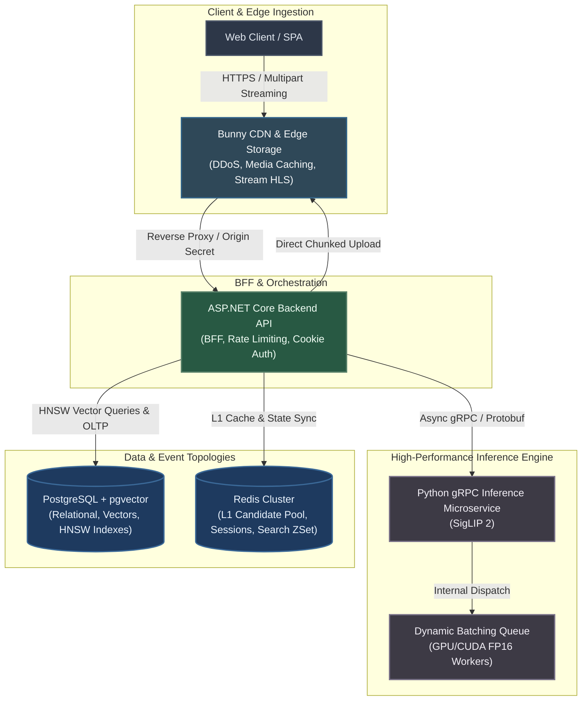
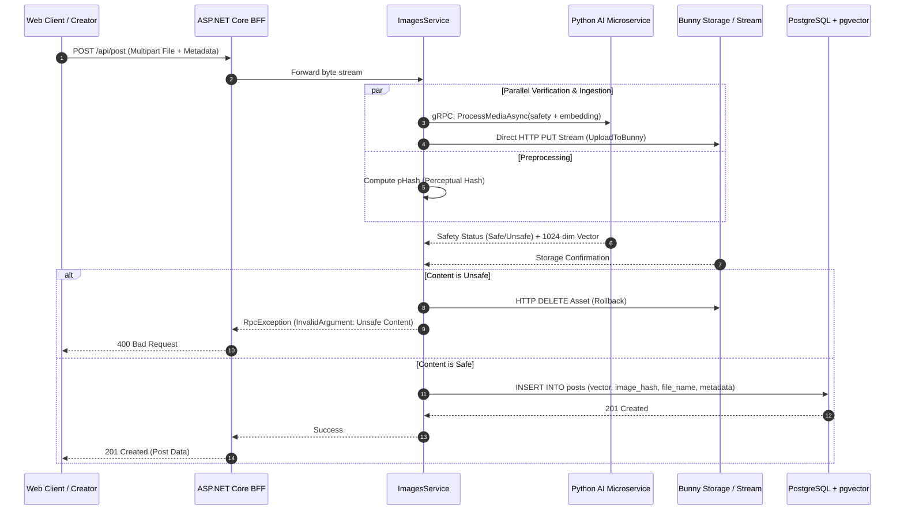

# 🌿 Poqy Engine & Architecture Case Study

> **A high-throughput, AI-native multimodal social ecosystem engineered with .NET 9, Python, PyTorch, and gRPC.**
[](https://dotnet.microsoft.com/)
[](https://www.python.org/)
[](https://pytorch.org/)
[](https://github.com/pgvector/pgvector)
[](https://redis.io/)
[](https://grpc.io/)
[](https://bunny.net/)

---

> **Live Platform:** Explore the production deployment at **[poqy.app](https://www.poqy.app)**  
> **Creator Ecosystem:** AI-native visual discovery, social feed, and portfolio hosting.
## 🎨 Visual Interface & Platform Experience

| Desktop view (light theme) | Mobile view (dark theme) |
| :---: | :---: |
|  |  |


**Poqy** is an AI-driven visual discovery and publishing platform built for creators, 3D artists, and photographers. The core platform solves the challenge of real-time semantic content distribution, low-latency visual moderation, and high-volume media ingestion without blocking server threads.

This repository serves as an **Architectural Case Study and Technical Specification**, presenting the foundational design patterns, data pipelines, vector search strategies, and sanitized backend modules.

---

## 🏛️ System Architecture

The ecosystem relies on an asynchronous, decoupled architecture where ingestion, vector inference, media delivery, and data persistence scale independently.


## 🌱 Core Subsystems & Engineering Highlights

### 1. Multimodal AI Inference & Moderation Engine (Python / PyTorch)
* **Unified Embedding Space (1024-dim):** Powered by Google's **SigLIP 2 Large** (`google/siglip2-large-patch16-256`), providing a single projection space for cross-modal search (Text-to-Image, Image-to-Text, and Video-to-Vector).
* **Dynamic GPU Batching (`DynamicBatcher`):** A custom thread-safe queuing mechanism with sub-20ms windowing and dynamic dispatch (up to 32 concurrent requests). Maximizes GPU/CUDA Tensor Core occupancy in FP16 precision without memory thrashing.
* **Autonomous Safety & Moderation Mesh:**
  * **Visual NSFW / Violence Filter:** Real-time multi-label classification via `Falconsai/nsfw_image_detection` targeting explicit content, violence, weaponry, and gore with adaptive thresholding.
  * **Multilingual Toxicity Shield:** `unitary/multilingual-toxic-xlm-roberta` combined with normalized dictionary whitelisting to eliminate profanity and hostile language in user bios, comments, and search queries.
* **Temporal Video Keyframe Decomposition:** Adaptive OpenCV extractor processing variable framerates down to 1.0 FPS (safety) and 0.2 FPS (mean pooling vectorization) within a strict 60-second execution envelope.
* **Semantic Anchor Validation:** Enforces interest taxonomy alignment by verifying cosine distance against baseline platform vectors ($\text{CosineSimilarity} \ge 0.20$), rejecting meaningless text or phonetic gibberish.

---

### 2. Multi-Stage Recommendation & Feed Scoring Engine (.NET 9 / C#)
* **Two-Tier Candidate Retrieval:**
  * **Hot Tier 1 (In-Memory Redis):** Single RTT pipeline extraction utilizing `SortedSet` and serialized candidate pools with pre-filtered 24-hour impression exclusion sets (`user_views:{userId}`).
  * **Cold Tier 2 (pgvector Native HNSW):** Direct database traversal via EF Core with raw SQL vector distance operators (`<=>`), bypassing expensive `NOT IN` predicates through in-memory hash index exclusion.
* **Stochastic A-Res Candidate Selection:** Implements **Algorithm of Reservoir Sampling with Replacement (A-Res)** over deterministic sorting to prevent visual fatigue and echo-chamber effects:
  $$\text{Key} = u^{1 / \text{Score}}, \quad u \sim \text{Uniform}(0, 1)$$
* **Temporal & Engagement Decay Function:**
  $$\text{Score} = \text{Relevance} \times \frac{\ln(2.0 + \text{Likes} + 2\cdot\text{Comments}) + 1.0}{(\text{AgeHours} + 12.0)^{0.75}} \times \text{SubscriptionMultiplier}$$
* **Diversity & Deduplication Filters:**
  * **Maximal Marginal Relevance (MMR):** Dynamically suppresses candidates with high vector similarity ($> 0.80$) against already selected posts in the active batch.
  * **Perceptual Hash (pHash) Deduplication:** 64-bit image hashing via `PerceptualHash` with Hamming distance verification ($\text{threshold} \le 6$) to eliminate re-uploads and near-identical renders.
* **Dynamic User Preference Shifting:** Sliding-window interest vector mutation based on real-time dwell telemetry:
```math
\vec{v}_{\text{new}} = \text{Normalize}\left((1 - \alpha)\vec{v}_{\text{old}} + \alpha \vec{v}_{\text{target}}\right)
```

---

### 3. Media Ingestion & Optimization Fast-Path (ImagesService)
* **Zero-Re-encode Fast-Path:** Non-blocking header identification via `SixLabors.ImageSharp.IdentifyAsync`. Valid, pre-optimized WebP payloads ($\le 1280\text{px}$) bypass raster pixel decoding entirely, avoiding GC memory pressure.
* **Pipeline Compression:** Non-compliant assets are downscaled to a max boundary of $1280\text{px}$, stripped of EXIF profiles, and encoded into WebP using Lossy Quality 82 (`WebpEncodingMethod.BestQuality`).
* **Concurrent Edge Dispatch & Streaming:**
  * Direct asynchronous HTTP PUT upload to BunnyCDN Storage zones with `ExpectContinue = false` to eliminate 100-continue handshake latency.
  * Native Bunny Stream integration supporting automated creation, binary streaming, and direct retrieval of adaptive HLS (`playlist.m3u8`) and preview assets (`preview.webp`).
* **Cache Evacuation Protocol:** Global Edge purge hooks (`https://api.bunny.net/purge`) executed immediately upon avatar and media mutations.

---

### 4. Resilient BFF & Security Gateway (ASP.NET Core)
* **Granular Rate Limiting Middleware:** Strict partitioned limits categorized by operation cost:
  * `FeedPolicy` & `ReadActionsPolicy`: Partitioned by Client IP / Token Bucket.
  * `WriteActionsPolicy`: Fixed Window limiting mutation calls (likes, comments, uploads).
  * `AuthIpPolicy`: Strict brute-force mitigation on authentication endpoints.
* **Multi-Token Persistent Authentication:** Secure session management storing encrypted JWT access tokens and long-lived refresh tokens with remote session revocation capabilities (`api/sessions/revoke`).
* **Background Telemetry Pipeline:** Non-blocking dwell time aggregation (`api/record-dwell`) allowing background UI analytics transmission without client stall.

---

## 🪴 Technical Trade-offs & Decisions

| Architectural Area | Selected Approach | Alternative Evaluated | Engineering Rationale |
|---|---|---|---|
| **Inter-Service Layer** | **gRPC over HTTP/2** | REST / JSON Web APIs | Strict Protobuf typing, reduced bandwidth via binary serialization, and efficient large payload streaming. |
| **Vector Storage** | **PostgreSQL + pgvector** | Standalone Vector DB (Pinecone, Qdrant) | Unified ACID compliance; joins relational metadata, author subscriptions, and vector cosine distance in a single query. |
| **Feed Selection** | **Stochastic A-Res + MMR** | Pure Top-$K$ Sorting | Eliminates repetitive content loops, boosts novelty, and guarantees fair organic impression distribution. |
| **Image Processing** | **SixLabors ImageSharp** | Magick.NET / System.Drawing | Fully managed, memory-safe C# execution with native cross-platform Linux container support. |
| **AI Inference** | **Custom Embedded Batcher** | Ray Serve / Triton Inference Server | Zero orchestration complexity, minimal memory overhead, and optimal single-node GPU saturation. |

---

## 🌿 Data Flow: Post Upload & Real-Time Ingestion


🍃 Key Performance & Scaling PatternsSingle-Roundtrip State Aggregation: Redis batch pipelines fetch user view histories, active session vectors, candidate pools, and trending IDs in a single network trip.Vector Normalization & SIMD Math: Normalized 1024-dimensional embeddings allow computing Cosine Distance via optimized dot-product kernels directly in memory and on GPU.Failure Resiliency: Graceful degradation logic: if the primary candidate pool is exhausted, the engine falls back through semantic similarity $\to$ global trending $\to$ emergency engagement pools without returning empty feeds.
